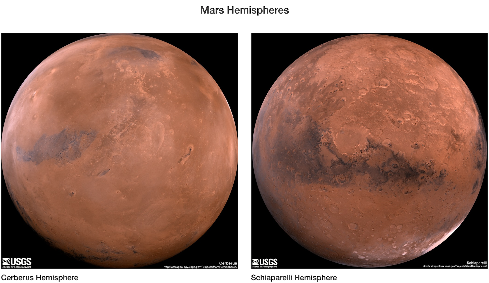

### Problem this project to trying to solve:
There are so many websites about interesting information about Mars, and new information is added to many of those websites every day. The purpose of this project is to create a web page that scrapes several websites to gather the latest data on Mars every time you click the button so users can stay up to do on Mars latest news/information.

### How to run the code:
1. Save all the files of the respository (except the files in the screenshots folder) to a folder on your computer.
    1. If you are using Windows, in the scrape_mars.py file, you will need to uncomment the 2 lines where it says to uncomment, and comment out the 2 lines about that.
1. Open you terminal.
1. cd into the folder you saved the files in.
1. Run the command "python scrape_mars.py".
1. Run the command "python app.py".
1. Open your browser and go to "http://localhost:5000/".
1. Click the "Scrap New Data Button" on the web page. It will take about a few minutes for the scraping to complete, and then the results will appear on the web page.

### Data collected:

### Why the data is displayed this way:
Cohesive ata was scraped from multiple different web pages, so I madde a web page of my own to neatly display all of it. I used Boostrap formatting and grids to make the page more visually appealing and responsive with all screen sizes.
